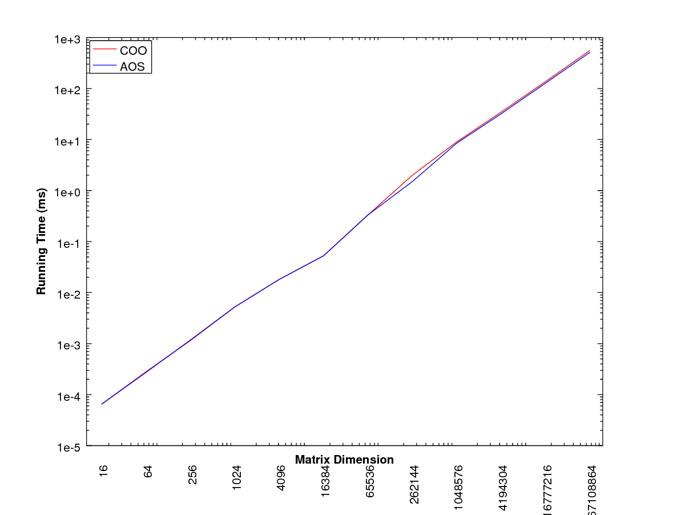
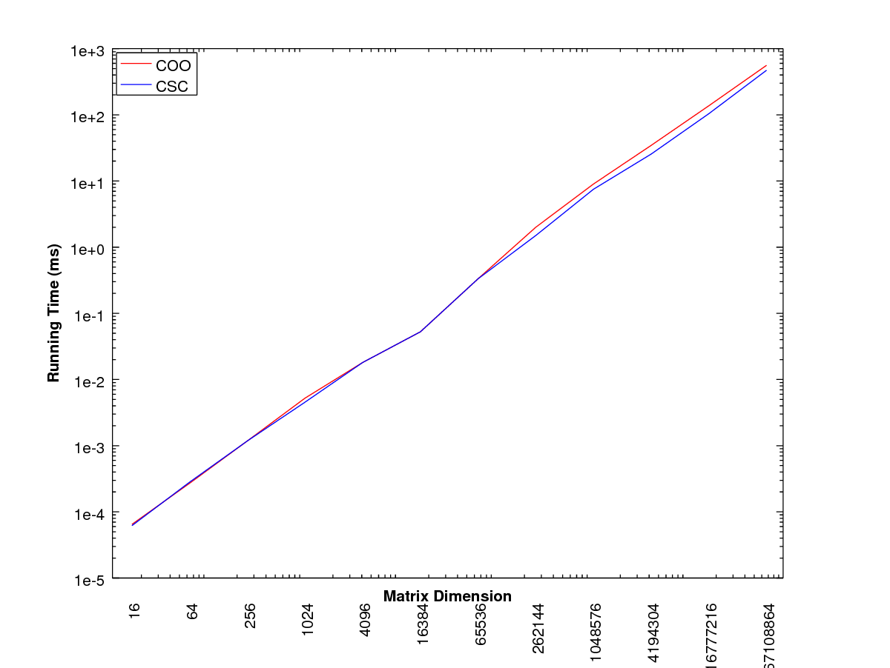

## Overview
This library consists mainly of various matrix classes with computational methods like QR factorization, matrix-vector and matrix-matrix multiplication, etc.

## Usage

## TODO
Create shared library.

## Benchmarking Results
Coordinate sparse matrix storage (array of structs) versus struct of arrays doing matrix-vector multiplication.

Compressed sparse column versus coordinate sparse (array of structs) storage doing matrix-vect
or multiplication.

