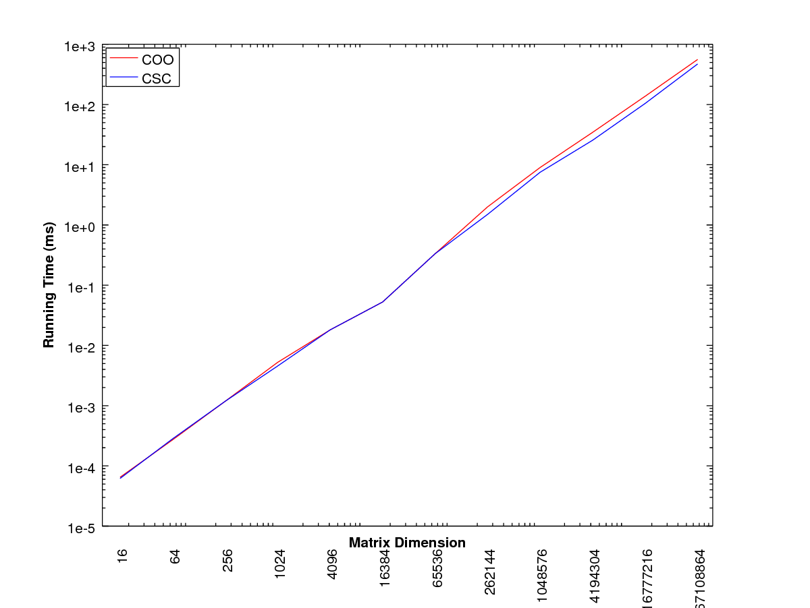

## Overview
This library consists mainly of various matrix classes with computational methods like QR factorization, matrix-vector and matrix-matrix multiplication, etc. Testing MPI and GPU computations is done using CUDA, MPICH, and Docker Compose.

Credit to Nikyle Nguyen for the cluster implementation on Alpine Linux using Docker Compose. See [his project here](https://github.com/NLKNguyen/alpine-mpich).

## Using Docker Images
Both Docker and Docker Compose must be installed on the host machine. Then do the following:
```bash
$ clone https://github.com/JohnSell620/HPC-Library.git
$ cd HPC-Library
$ sh ./cluster.sh up [size=10]
```
This will pull the Docker images `jhnns/ubuntu-cuda-mpich:latest` and `jhnns/ubuntu-cuda-mpich:onbuild` from [Docker Hub](https://hub.docker.com/).

## Building Without Docker Containers
### Install Open MPI
Some benchmarking programs depend on Open MPI, but it's not required for most programs. Skip steps 1 through 3 if using these is not desired.
1. Download Open MPI (recommend extracting contents in /usr/local).
2. Run the following commands.
```bash
$ wget https://download.open-mpi.org/release/open-mpi/v3.1/openmpi-3.1.3.tar.gz
$ tar -xzvf openmpi-x.x.x.tar.gz
$ cd openmpi-x.x.x
$ sudo ./configure --prefix=$HOME/openmpi --enable-mpi-cxx
$ sudo make all
$ sudo make install
```
3. In ~/.bashrc file, add the following lines.
```
export PATH=/path/to/openmpi/bin${PATH:+:${PATH}}
export LD_LIBRARY_PATH=/path/to/openmpi/lib\${LD_LIBRARY_PATH:+:${LD_LIBRARY_PATH}}
```

### Building and Using the library
Run the following commands to build the HPCLibrary library.
```bash
$ clone https://github.com/JohnSell620/HPC-Library.git
$ cd HPC-Library/HPCLibrary
$ mkdir obj exe lib
$ make classes
$ ar rcs lib/libHPCLibrary.a obj/*.o
```
The following command links the static library to `main.cpp`:
```bash
$ c++ -std=c++11 -I ./inc -L ./lib -static ./tests/main.cpp -lHPCLibrary -o ./exe/libHPCLibraryClient
```
Now run `$ ./exe/libHPCLibraryClient` to see the output of `main.cpp`. To build the benchmarking tests, just run `$ make`.

Run `$ make precomp_headers` to pre-compile the .hpp files, and include these to optimize programs.

## Usage
Try these commands from the HPC-Library/HPCLibrary directory after running `make all`.
```bash
$ ./exe/bench
$ ./exe/csrbench
$ ./exe/sparsebench
```

## Benchmarking Results
Coordinate sparse matrix storage (array of structs) versus struct of arrays doing matrix-vector multiplication.


Compressed sparse column versus coordinate sparse (array of structs) storage doing matrix-vect
or multiplication.



## TODO
1. Fix gpu_densebench.cu timing issue.
2. Correct Matrix::qr() factorization.
3. Correct issues with MPI on Docker Compose.
