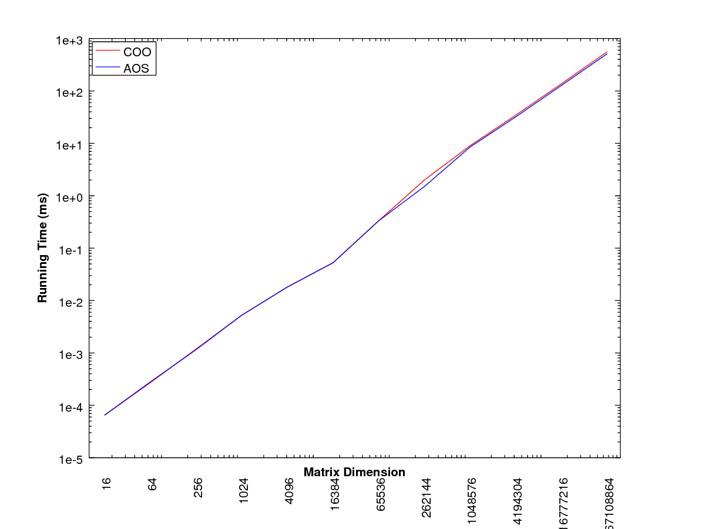

## Overview
This library consists mainly of various matrix classes with computational methods like QR factorization, matrix-vector and matrix-matrix multiplication, etc.

## Building
### Install OpenMPI
Some benchmarking programs depend on OpenMPI, but it's not required for most programs. Skip steps 1 through 3 if using these are not desired.
1. Download OpenMPI (recommend extracting contents in /usr/local).
2. Run the following commands.
```
$ tar -xzvf openmpi-x.x.x.tar/gz
$ cd openmpi-x.x.x
$ sudo ./configure --prefix-$HOME/openmpi --enable-mpi-cxx
$ sudo make all
$ sudo make install
```
3. In ~/.bashrc file, add the following lines.
```
$ export PATH=/path/to/openmpi/bin${PATH:+:${PATH}}
$ export LD_LIBRARY_PATH=/path/to/openmpi/lib\${LD_LIBRARY_PATH:+:${LD_LIBRARY_PATH}}
```

### Building and using the library
Run the following commands to build the HPCLibrary library.
```
$ clone https://github.com/JohnSell620/HPC-Library.git
$ cd HPC-Library
$ mkdir obj exe lib
$ make classes
$ ar rcs lib/libHPCLibrary.a obj/*.o
```
The following command links the static library to `main.cpp`.
```
$ c++ -std=c++11 -I ./inc -L ./lib -static ./tests/main.cpp -lHPCLibrary -o ./exe/libHPCLibraryClient_static
```
Now run `./exe/libHPCLibraryClient_static` to see the output of `main.cpp`. To build the benchmarking tests, just run `$ make`.

Run `$ make precomp_headers` to pre-compile the .hpp files, and include these to optimize programs.

## Usage
Try these commands from the HPC-Library directory after running `make all`.
```
$ ./exe/bench
$ ./exe/csrbench
$ ./exe/sparsebench
```

## Benchmarking results
Coordinate sparse matrix storage (array of structs) versus struct of arrays doing matrix-vector multiplication.


Compressed sparse column versus coordinate sparse (array of structs) storage doing matrix-vect
or multiplication.

